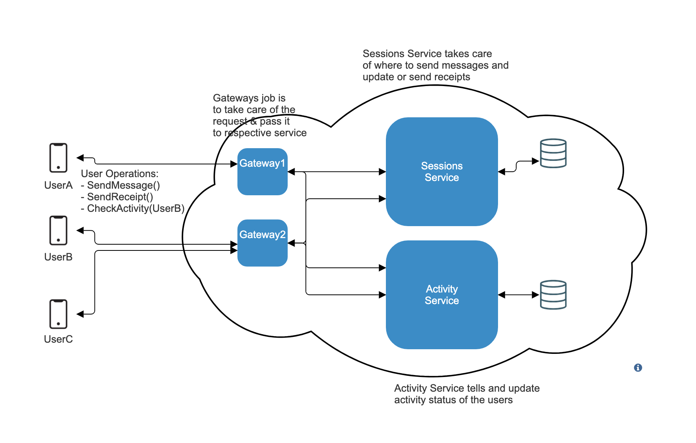
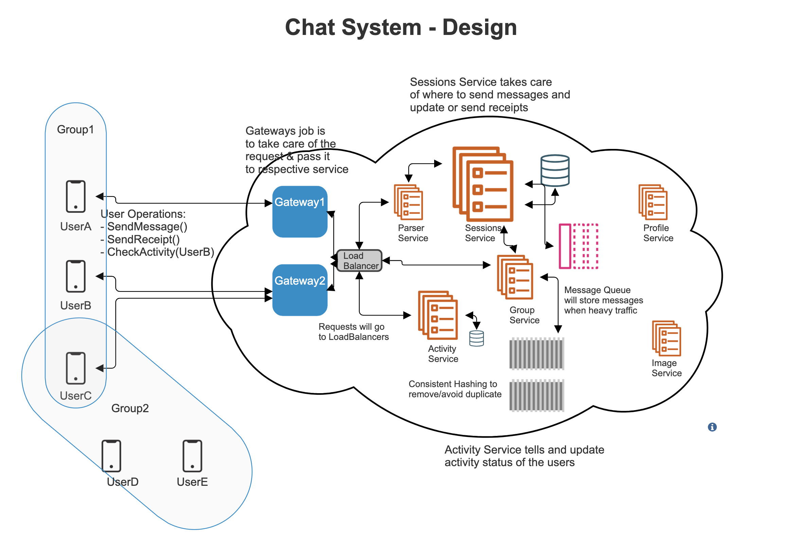

# Design a Chat based application

## Features:

- One to One chat
- Group Messaging
- Sent, Delivered, Read receipts
- Image/Video Sharing
- Online/Last seen
- Chats are deleted (Optional)

- ### Image Service:

  - Storing Images
  - It is kinda tedious process. Now lets discuss, how can we store images
  - Should we store as a File or Blob (Binary large objects)
    - Images are large in size and can not store as varchar
    - Images can be stored in DBs as Blob. If stored in DBs, what will be the benefits:
      - Mutability: Not necessary for us in case of images, as if we ever change image, we will not update the binary object of an image. Rather we will update it with a complete new image
      - Transaction properties: Not required by an image. As we will not be doing atomic changes to image
      - Indexes: Allow us to sort data, which help us find element faster. But for image, we will not be sorting binary
      - Access Control: It can get tedious
    - Good things about having file system:
      - Cheaper
      - Built for storing a file, so it is faster
      - Files are static, so we can have CDN for fast access
      - We will still have a db that will store - profile_id, image_id and image_url. image_url will be location for a distributed file system, for above benefits

- ### One to One Chat

  - You have applications on your mobile phones and you're connected to Chat System's cloud
  - Firstly, a peer should be connected to a gateway, rather than directly reaching to a controller/service.
    - Because, user will be using an external protocol while talking to a server whereas chat system's internal system might be using different language/protocol
    - Internally big headers won't be required. As they might be secured once they pass through gateway system.
    - Peers should be connected to a gateway (system), that will redirect the request to a specific service
  - There can be many gateways for faster, robust system, as for a chat system like messenger or whatsapp, there can be millions/billions of users at different locations.
  - So let's say if UserA needs to send a message to UserB
    - Lets say UserA is connected to a gateway Gateway1, but we have to find out which gateway is UserB is connected to.
      - We have to store this map somewhere in gateway but it will require a lot of redundant data and there will be a lot of updates required. So this is probably not a fast and robust way to store.
      - We can have a microservice that will handle all of this data. Lets call it Sessions Microservice.
    - Now lets say Gateway1 gets a message, it doesnot have to do anything and just sent the data to Sessions Microservice.
    - Now Sessions Microservice will take care of where to find and send message which will be easier for Sessions as it knows everything
    - But sending a message to UserB will not be possible over an HTTP protocol, as it supports Client-Server Architecture. So we need some Peer-Peer sevice over TCP, like WebSockets.
    - WebSockets will allow user to send message and vice versa too.

- ### Sent, Delivered, Read receipts

  - Once Sessions service gets a message, it will return a response that the message is delivered.
  - Once Sessions service gets a message to UserB and it is delivered. UserB sends a delivery receipt and it routes the same message to UserA
  - The moment UserB opens and reads the message, it will send a receipt and it will be send to Sessions service and then UserA

- ### Online/Last Seen:
  - This feature is only possible when a specific user asks Sessions Service when was UserA was online
  - But this all data needs to be stored in db and updated concurrently for all users
  - For the sake of simplicity, we can have a threshold for example 10 sec before updating the last seen
  - We can have a new Service that take care of the Last Seen too, for the above.

- ### Group Messaging
  - Lets say UserA, UserB, UserC are connected in a group Group1 and UserD, UserC, UserE are connected in other group Group2
  - These users can be connected to any gateways. Sessions service stores the information about users and gateways.
  - To store group informations in sessions service it is quite complex. So, we create a new Service called GroupService.
  - So, when a request comes to sessions service, it asks group service about users in that group.
  - Since gateway needs to fast, we will not do parsing or creating objects etc. on gateway service. So, we create a new service, Parser Service, that takes care of any small tasks that needed to be done before sending it to sessions service. Which will decouple application and make gateway free for more requests(reduce memory for gateway)
  - GroupService will have mapping for groupIds to userIds (one to many) and helps routing to right destinations
    - We need to reduce duplicacy, and we can use `Consistent Hashing`(read). It helps you reduce the memory to print accross servers
  - Lets say, if you send the message to gateway and it fails, we will have to retry. So, we will need to use `Message Queue`. Even after multiple retries it fails, it should update the sender.

