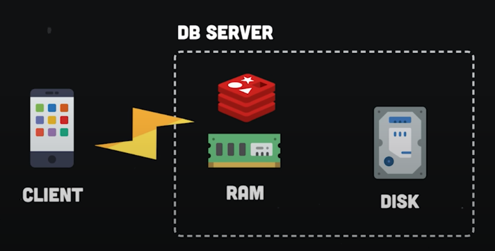
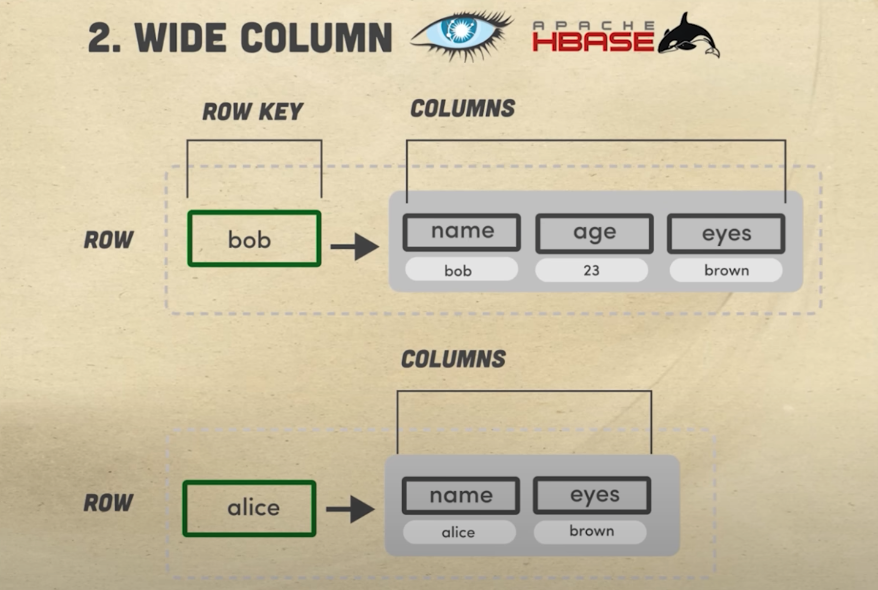
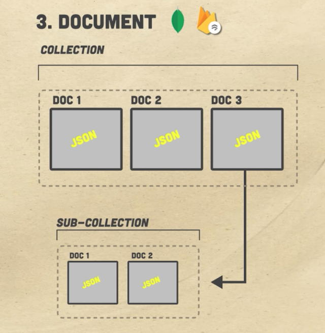
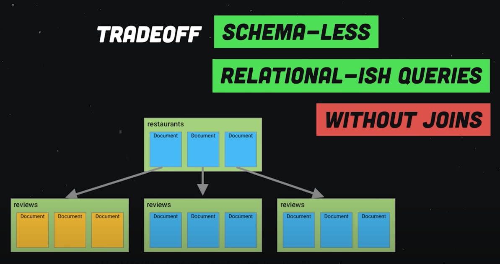
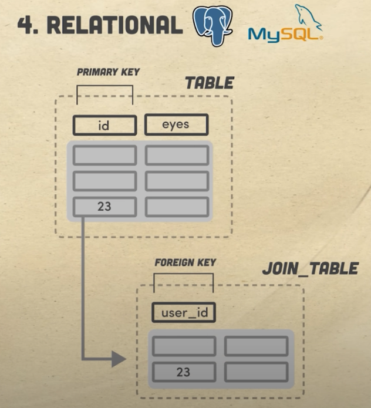
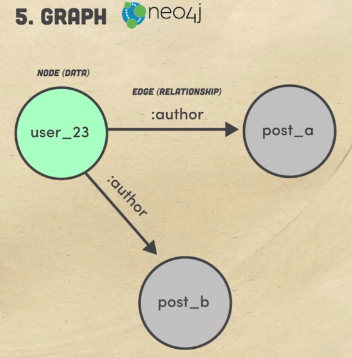
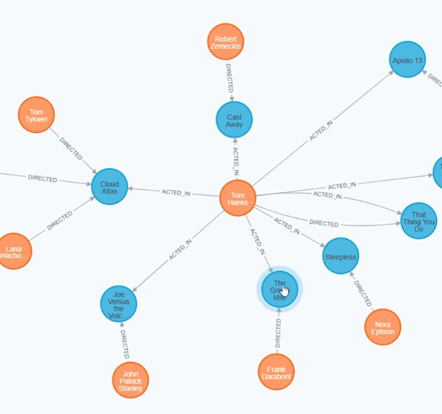
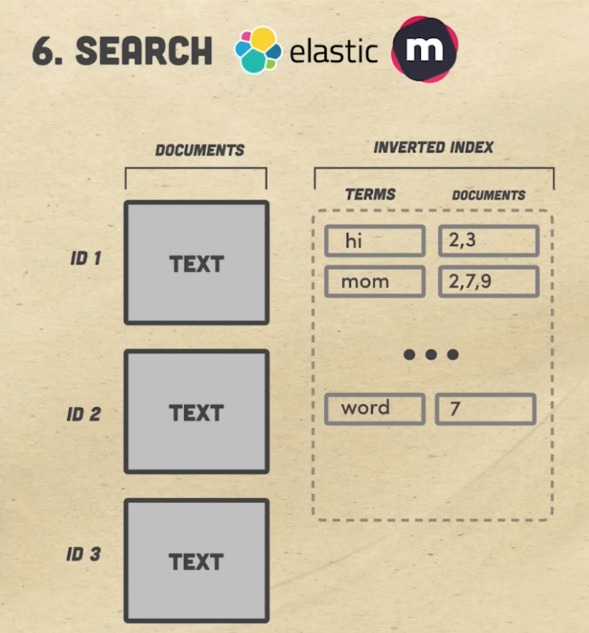
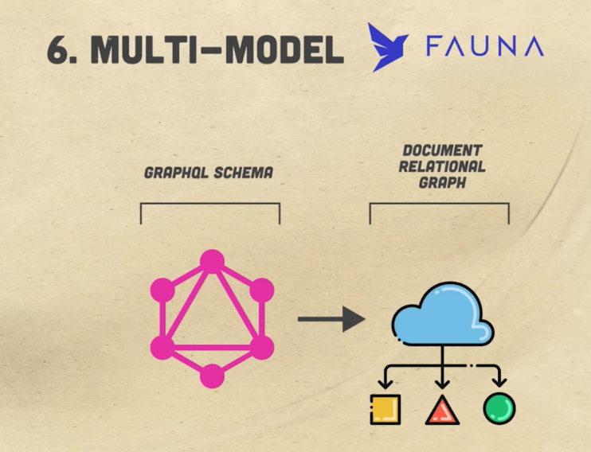
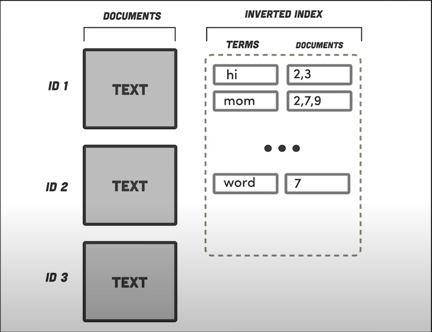

# Database Paradigms

### There are 7 different database paradigms

- ### 1. Key-Value pair
- ### 2. Wide-Column DB
- ### 3. Document
- ### 4. Relational
- ### 5. Graph
- ### 6. Search
- ### 7. Multi model

## Key-Value Pair:

- Popular databases: Redis, Memcached
- Database is structured as a Javascript object
  - In the form of key-value pair
  - Key is unique and points to some value
  - In the case of Redis and Memcached, all the data is held in the machine's memory (RAM) and not in disk like other dbs
    - It limits the amout of data you can store but makes the db extremely fast and doesn't requires quering to the disk for every operation
    - It does not allow joins and queries so the data modelling options are limited
      
    - Best used for caching, PUB/SUB or Leaderboards to reduce data latency
    - Mostly used for caching on other persistent data layer

## Wide Column DB

- Popular databases: Cassandra and HBase
- It is like key-value database but it holds 2D data as value
- Every key is mapped to set of columns that hold set of ordered rows grouped together
- It is not a relational database, so it doesn't have a schema, so it can handle unstructered data
- Can use CQL (similar to SQL) but can't do joins
- Much easier to scale-up and replicate data across multiple nodes
- Its decentralized and can scale horizontally
- Used to store time-series data like records from IoT devices or history of what netflix shows you have watched at what time
- Used in the situation when you have frequent writes but very less reads

## Document

- Popular databases: Mongodb, firestore, dynamodb, couchdb
- Primary kind of database
- In this type of dbs we have documents that contains key-value pairs
- They are unstructured and don't require a schema
- Documents are group together as collections
  - fields in the collection can be indexed
  - collections can be organized in a heirarchy
- Models relation db quite a lot but it isn't
- Allows relational-db type queries without joins
  - So instead of normalizing it, we embed data into a single document
- Reads could be much faster but writing and updating data can be quite complex
- Best used for mobile app, games, IOT, content management
- Best place to start but not ideal for something like graphs (social media)
  

## Relational

- Popular: Mysql, Postgres, SQL server
- Uses SQL to access and write db
- Why is it called relational?
  - data is divided into parts which holds data with a unique serial number (ids)
  - when we wanna use the data in different parts we build a relationship using their ids and storing in a new table as a foreign key
  - We can use join to use the data together
- SQL dbs are ACID compliant: data validity is guaranteed, good for banks
- Not good to scale, except for some new dbs for example CockroachDB
- Not ideal for unstructured data

## Graph

- Data is represented as nodes and relationships between them as edges
- Popular db: Neo4J, dGraph
- Its easy to join two data, i.e. just using an edge
- Querying is also very concise as compare to SQL
- Better performance on a larger datasets
- Best used for graphs, Knowledge graphs, recommendation engines
- Mostly used for social media, fraud detection
  

## Search

- Popular db: Solr, Elastic Search, Meilisearch
- Aka FullText search engine
- Very similar to Document oriented database
  - We have an index matched with some data objects
  - under the hood, it analyze all the text in the document and creats an index of the searchable term
  - when a user performs a search, it only scans the index and not every document, thus very fast
  - Also runs a vatiety of algorithms like ranking, handle typo etc
- Most used for Search engines, typeahead like search boxes

## Multimodel

- Best popular: FaunaDB
- It is best if you don't want to worry about joining, indexing or creating schema for the db
- For example, for a Frontend Engineer, they want to access data using GraphQl. If we upload the graphql schema in Fauna, it will automatically creates collection to store data and indexes to query data
- Behind the scenes, it thinks how to take advantage of multiple database paradigms like graph, relational or document.
- You can just use the db like you use document db but not stuck with the limitations like data modelling
- ACID compliant
- Extremely fast
- Don't need to provision
- Just need to decide how to consume
  
