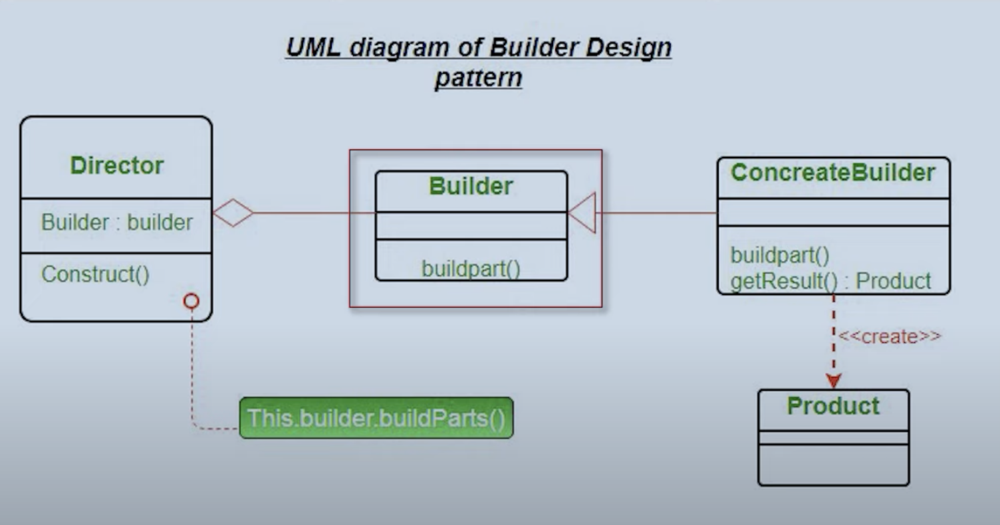

# Design Patterns

## What are Design Patterns?

- We know the concepts are Oops and using those, we are supposed to write the code that is scalable, reliable and highly maintainable.
- While writing code there are some common problems, that we all get stuck with:
  - How do we create the classes?
  - How to instantiate
  - How do we structure them?
  - How do the classes interact
- There are some templates that are created for us. These are called Design Patterns.
- Design Patterns are reusable solutions, for the problems that we encounter in day to day program. Not language dependent and can be used with any Oops supported language

## Types of Design Patters

- ### Creation Design Patterns
  - Factory
  - Abstract Factory
  - Singleton
- ### Structural Design Patterns
  - Bridge
  - Adaptive
  - Composite
- ### Behavioural Design Patterns
  - Interpreter
  - Strategy
  - Observer

## Factory Design Pattern

- ### Example:
  - Client has asked you to create a vehicle library
  - Vehicle can be anything, car, bus, bike
- We have created an orthodox way of doing it. Now if we need to scale/extend it to different Vehicles we will have to make changes to our if else condition in our Client class which will be an overhead for our Client
- It is tightly coupled
- To make it losely coupled, we will add a factory class, to make it scalable.

### Solution

- Client just calls Factory class
- Client doesn't need to know how the object is created
- Client doesn't need to update its class when there is any change in classes
- It is losely coupled now

### Benefits

- Loose coupling
- Encapsulation
- Code reuse
- Extensibility
- Flexibility
- Resilience

## Singleton Design Pattern

- There are some times when we don't need multiple instances of a class. For example, to access db or to have a logger
- For those cases we use Singleton Design Pattern
- In these cases, we create a class for which the instance is always created once. This can be achieved by
  - Early Initialization
  - Late Initialization
  - Thread Safe

### Advantages:

- Resource management: TheSingleton pattern helps manage resources efficiently.
- Global access: The Singleton instance is accessible from anywhere in the application, eliminating the need to pass objects' instances.
- Lazy loading: Lazy Instantiation allows resources to be allocated only when needed, improving performance.
- Reduce complexity: The Singleton pattern can reduce the complexity of creating and managing multiple instances of a class.
- Improve performance: The Singleton pattern can improve the performance, memory usage, and consistency of an application.
- Enforce logic: The Singleton pattern can enforce a certain logic or behavior in an application.

## Builder Design Pattern

- Its a creational design pattern
- Whenever we build a very complex object which has a lot of configuration in it, we use builder design pattern
- Used extensively, as real life objects are complex

### Example

- Building a vehicle class, with different type of engines and its part, there can be a lot of things
- Buiklding a desktop class, with a lot of parts that can be configured

- Builder design pattern has 4 parts:  
  
  - Product: Example is Desktop
  - Builder: DesktopBuilder, an abstract class that tells us which functions need to implemented by concreteBuilder
  - ConcreteBuilder: Implement the functions that are mentioned, using the configured types
  - Director: Actual generation of the product. Tells the direction/steps of building the product. (Kind of similar to main)(Optional)

## Observer Design Pattern

- Easy and widely used design pattern
- Suppose we are logged into multiple devices like laptop, mobile etc. As soon as notification comes, all devices are updated at once
- Similarly, a small change can lead to change in multiple places. That's when we need observer design pattern
- Another way of thinking - there are some publishers that publish some change and then there are some subscriber that subscribe to those change. So as soon as publishers, publish change, all the subscribers get notified.

## Abstract Factory Design Pattern

- Creational Design Pattern, similar to Factory
- Additional to Factory, if client is looking to add more specification, we can not have so many if blocks
- Our facotry design pattern was creating concrete classes and objects. Our abstract factory will creat factories that will create class and object

### Examples

- Lets say if we have to create a Button and TextBox on different OS so we want to create a Facotry taht is abstract from Sclient

## Adaptive Design Pattern

- Adaptive DP is used to make two incompatible object are made compatible using adaptive class
- The adapter pattern converts the interface of a class into another interface client expect. Adapter lets classes work together that couldnt otherwise because of incompatible interfaces.
  

### Example:

