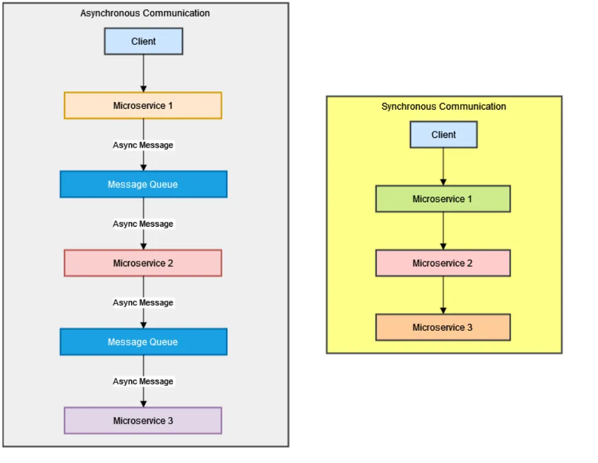
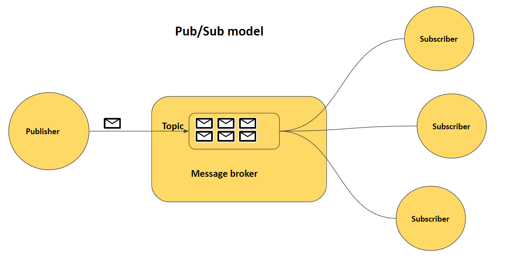
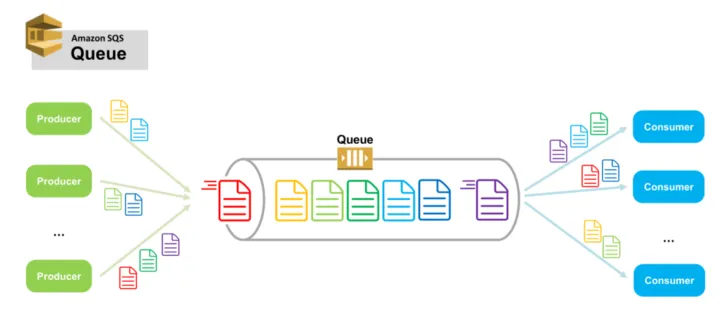

# Asynchronous Communication in Distributed Systems

- When we need communication between different services or software components, there are two common communication patterns, synchronous and asynchronous communication.
  - Synchronous messaging is a pattern in which the sender waits for a response before proceeding with its operation.
  - Asynchronous messaging is a communication pattern in which messages or requests are sent between different components or systems without requiring an immediate response.
    

### Asynchronous Messaging and why it is important?

- The sender can send a message or request and continue its work without waiting for a response. The receiver processes the message whenever it becomes available. This decoupling of sender and receiver allows for greater flexibility and scalability in distributed systems.

- To implement the asynchronous pattern the application creates a producer-consumer pattern.
  - The producer generates the messages towards a middleware component to ensure resilience and fault tolerance.
  - This middleware is usually implemented as a queue, often managed by a message broker.
  - The consumer can then read the message from the message broker without communicating directly with the producer.

### The key aspects of Asynchronous Messaging are:

- Decoupling sender and receiver, enabling them to operate independently for flexibility, scalability, and fault tolerance in a distributed system.
- Message queue as a buffer that temporarily stores messages until the receiver can process them
- Workload distribution with parallel processing as the sender-receiver processes messages at its own pace without blocking the sender.

### Use Case of Asynchronous Messages

- E-commerce: Processing asynchronous messaging for orders. If a customer places an order, its details are sent as an asynchronous message to the order processing system. This means the system can still handle the order at its own pace while processing payment without blocking the customer’s interaction with the app.
- Notifications and Alerts: used to send users notifications and alerts. This is a common generation of social media applications. Asynchronous messaging handles events such as notifications for new messages. In this case, the messages are queued and delivered to users when they are online or available to receive notifications.
- Background Processing: uses to offload resource-intensive tasks to background workers. In such a case, the messages representing tasks will be saved to a queue where service workers retrieve them asynchronously once done. Such processing means the main application thread will remain responsive while the tasks are executed in the background.

### Asynchronous vs Synchronous communication

For any application communication to take place, it requires the sender and receiver. At this point, we can describe the main differences between synchronous and asynchronous message patterns:

In synchronous massaging pattern, the sender and the receiver are aware of each other, the communication is strict between the two parties, and the sender and receiver must be present as the messages are being processed immediately.

In an asynchronous massaging pattern, on the other hand, the sender does not aware of the receiver’s condition and even how many receivers there are, it is only guaranteed that the message will be processed at some point in the future. This part of the system’s architecture is derived from the communication pattern, and as mentioned before, asynchronous communication will be usually supported by a Message Broker.

### Asynchronous messaging offers advantages such as:

- It ensures message persistence and history. The message flow is regulated using message brokers. It saves the messages for participants to retrieve them.
- Asynchronous messaging is global and not limited to time zones.
- Flexibility to respond to messages at convenience. Consumers engage with the message and respond when available.
- It’s built for resilience and scalability. All the components (producers, consumers, broker) are separated, and you can scale each of them when independently.
- Decouples your application in mini services to improve performance and throughput.

### Asynchronous messaging introduces disadvantages such as:

- You need additional components like message brokers to create a complete async pattern. In addition, you must have the expertise needed to use message brokers.
- Messages are stored in a queue. This introduces potential points of failure, such as ensuring messages were delivered to intended receivers, message duplication, and failed message deliveries.
- To implement an asynchronous messaging design, you need timeouts, message loss, retries, and failed processing attempts concepts that increase development complexity.

## Note: The Pub/Sub model and message queues are both used for asynchronous communication in distributed systems, but they serve different purposes and have different characteristics.

## What is Publisher Subscriber?

- used when working on an application that needs to be easily maintainable, scalable, and performant
- Request senders are called publishers. Their role is to send or publish messages. They don’t care about who is going to receive them or if someone will receive them at all.
  - for example, TV channels. Sports channels, Weather Forecasting channels sends its messages to a certain channel, and whoever is subscribed for this channel will be able to receive these messages.
- The message consumers are called subscribers. They can subscribe to one or more channels and start receiving the messages.
- The messages that are sent are forgotten. And thus if a subscriber subscribes for a certain channel, all the messages that were sent previously in that channel are not going to be available to this subscriber.
  - Due to this, we can easily achieve low coupling between the different components and provide a solid foundation for building robust and easy-to-maintain applications.
- So, when replacing or scaling publishers, we don't need to worry who will get it.
- Pub/Sub messaging allows to create decoupled applications easily with a reliable communication method and enables users to create Event-driven architectures.
- Event-driven architecture (EDA) is a software design pattern that enables a system to detect events (such as a transaction or site visit) and act on them in real time or near real time.
  

## What is Message Queue?

- A message queue is fundamentally any technology that acts as a buffer of messages

  - It accepts messages and lines them up in the order they arrive.
  - When these messages need to be processed, they are again taken out in the order they arrive.

- The architecture of a message queue is:

  - Producers/Publishers create messages and add them to the message queue.
  - Consumers/Subscribers pick up these messages and process them.

  

### Some examples of message queues are Apache Kafka, RabbitMQ, and LavinMQ

Example - how message queues are used in asynchronous communication

- Lets take order processing service that could forward the details of new orders to the payment processing service synchronously via an API call in an e-commerce platform.
- We can replace the synchronous API with a message queue.
- The message queue will sit between the two services (producer/consumer).

  - The order processing service will act as the consumer that produces and adds messages to the message queue.
  - The payment processing service will then act as the consumer that processes messages added to the queue.

- This is significantly better than the synchronous approach.
- If the payment processing service experiences an unexpected failure, the order processing service will continue to accept requests and place them in the queue as if nothing had occurred.
- The requests will always be present in the queue, waiting for the payment service to process them when it is back online.
- This leads to a more reliable architecture with no single point of failure
