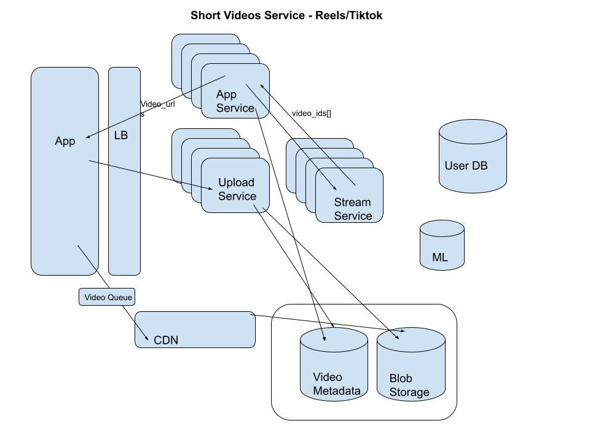

# Reels

#### Clarifying Questions:

- Use Cases?
  - Video uploads
  - Streaming/consuming videos
- How many users and uploads?
  - 1B users
  - 150 countries
  - 1B views per day
  - 10B videos upload per year
- What will be some success metrics?
  - Time on App: maximize (1 hour per day)

#### Non-functional Requirements/Detailed Calculations:

- lets say 100 sec video on average
- 1080\*1920 pixels: 1MB per video
- Storage Calculations:

  - 10B\*1MB ~ 10PB of videos per year
  - (different forms + replication)\*10 ~ 100PB per year as a BLOB storage
  - 10B\*1KB ~ 10TB of video metadata (stored as a NoSQL)

- upload calculation:

  - 10B/365 ~ 30M per day, i.e. 300 videos per second, (1000 videos per second at peak)
  - 1000 videos \* 1 MB(10Mbits) ~ 10Gbps ingress (doable nowadays)
    Note: for network calculations, it is a norm to use bits and not bytes

- views calculation:
  - 1B per day / 100,000 ~ 10,000 videos per second
  - 100Gbps egress

#### High level design

- ##### Components:

  - Application Load Balancers
  - App Service
  - Upload Service
  - Stream Service
  - Video Databases
    - Video Blob Storage (tiered AWS S3)
    - Video Metadata (Dynamo Db (NoSQL))
      - It will contain video_ids
      - video_urls for different forms like (pixels)
      - creation_time
      - creator_id
      - likes
      - comments
      - views
      - length/duration
  - User Databases
    - User DB (RDB that can be scaled to billions of users like Google Cloud Spanner)
    - Metadata
      - user_id
      - credentials
      - name, age, desc etc
      - follower_list[]
      - following_list[]
      - posts[]
      - watched_ids[]
      - saved_videos[]
      - time_in_app
      - exclusion_profile

- ##### Upload flow

  - Blob Storage:
    - Replicated db based on regions etc
    - if the video is old and not seen recently, can go to slow offline storage
  - Video Metadata
    - NoSql db to store metadata related to videos that can scale
  - User DB: contains user metadata
  - For different regions and countries:
    - We will need data near to user to make it faster responsiveness
    - We can partition the data based on regions/countries
    - We can have a caching mechanism like CDNs (CloudFront) to cache data which is popular in a region or country
  - Upload Service: (Service used to upload video to the app)
    - We will need to direct our data to Blob storage and Video Metadat

- ##### Download/Stream flow

  - App Service:
    - Talks to backend algorithm (Stream Service) to generate what to show the user, as soon as user opens the app.
    - We can use Machine Learning algorithm to curate a list of videos as soon as user opens a app
    - Once, app service has the list of video_ids, it queries the video metadata db to return all sort of informaation like poster, likes, comments, views, etc
    - list of videos are fetched either from CDNs or stored in Blob storage and store it in queue for less latency
  - Stream Service:
    - It computes the list of video_ids to show to the user at the moment
    - Also, consistently computes the next set of video_ids based on followings, and current mood (how much time spend on what kind of videos, what kind of videos are being liked)

#### Bottlenecks and Enhancements

- ML Algorithm for stream service can have some latency while working on the cloud and throwing the user_ids but if we can package the the service itself with the app, it can reduce latency by using devices computing power to generate user_ids
- For enhancements, have a tweaked parameter in ML algo to change video list for user to see how user reacts
- We can have a new service to compute what kind of sponsored videos (ads) should we show to specific targeted audience based on user preferences
- Instead of using DynamoDb to build solution to reduce cost
  
